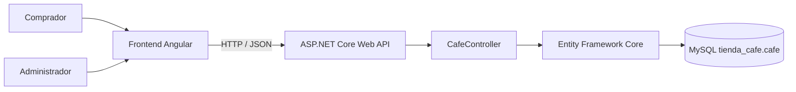

# Documentación integral — Café Premium

## 1. Resumen

Café Premium es una aplicación web local para mostrar un catálogo de café colombiano y administrar su inventario. El frontend Angular consume una API REST ASP.NET Core; la API valida y transforma las solicitudes JSON y persiste los datos en MySQL mediante Entity Framework Core.

El producto se organiza en dos vistas: comprador (`/catalogo`) y administrador (`/admin`). El comprador consulta el catálogo; el administrador mantiene los registros de café. El login con Google y las órdenes de compra son ampliaciones futuras, no funciones activas de esta versión.

## 2. Alcance funcional

### Disponible

- Listado de cafés desde MySQL.
- Búsqueda en nombre, especialidad, presentación, origen y descripción.
- Creación, edición y eliminación de cafés desde el panel administrativo.
- Visualización de precio, origen, presentación, cantidad y descripción.
- Validación de campos en el frontend y el modelo de la API.
- Actualización del listado después de una operación del CRUD.
- Límite de espera para solicitudes HTTP y mensajes de error diferenciados por validación, timeout, conexión o respuesta HTTP.
- Diseño responsivo con Bootstrap 5 y estilos propios.

### Preparado para una etapa posterior

- La página `/login` es una base visual; no crea sesiones ni se conecta con Google.
- `/admin` no está protegido por autenticación. No publicar el panel en un servidor accesible sin implementar autorización.
- El área **Órdenes de compra** es un marcador visual. No existen modelo, tabla, endpoint, carrito, pedido ni pago en la API actual.

## 3. Arquitectura



El frontend no se conecta directamente a MySQL. Sus solicitudes usan `CafeService` y la API en `http://localhost:5031/api/cafe`. La API usa `AppDbContext` para consultar o persistir los registros.

## 4. Tecnologías y estructura

| Área | Tecnología |
|---|---|
| Frontend | Angular 22, TypeScript, Angular Router, FormsModule |
| Componentes visuales | Bootstrap 5 más CSS del proyecto |
| Renderizado | Angular SSR |
| Backend | ASP.NET Core 10, controladores API |
| Persistencia | Entity Framework Core, `MySql.EntityFrameworkCore` |
| Base de datos | MySQL |
| Herramientas de prueba | Postman y scripts SQL para MySQL Workbench |

```text
tienda-cafe-fullstack/
├── backend/
│   ├── API_CON_DB.slnx
│   └── API_CON_DB/
│       ├── Controllers/CafeController.cs
│       ├── DB/AppDbContext.cs
│       ├── Models/Cafe.cs
│       ├── Properties/launchSettings.json
│       ├── Program.cs
│       ├── API_CON_DB.csproj
│       └── appsettings*.json
├── database/
│   ├── schema.sql
│   └── demo-data.sql
├── docs/DOCUMENTACION_PROYECTO.md
├── frontend/
│   ├── src/app/pages/home/
│   ├── src/app/pages/login/
│   ├── src/app/Services/cafe.service.ts
│   ├── src/app/Models/cafe.ts
│   ├── angular.json
│   └── package.json
├── postman/Cafe-Premium.postman_collection.json
├── .gitignore
└── README.md
```

### Archivos clave

- `backend/API_CON_DB/Program.cs`: registro de controladores, cadena MySQL, OpenAPI y CORS local.
- `backend/API_CON_DB/Controllers/CafeController.cs`: operaciones REST de café.
- `backend/API_CON_DB/Models/Cafe.cs`: modelo, validaciones y correspondencia a columnas MySQL.
- `backend/API_CON_DB/DB/AppDbContext.cs`: contexto de Entity Framework.
- `frontend/src/app/app.routes.ts`: rutas para catálogo, administración y login.
- `frontend/src/app/pages/home/home.ts`: estado de la pantalla, carga, búsqueda y operaciones CRUD.
- `frontend/src/app/pages/home/home.html`: catálogo/comprador y panel CRUD/admin.
- `frontend/src/app/Services/cafe.service.ts`: llamadas HTTP a la API, con timeout de 10 segundos.
- `frontend/src/environments/environment.development.ts`: URL de API para desarrollo.
- `database/schema.sql`: base y tabla vacías con el esquema esperado.
- `database/demo-data.sql`: tres cafés de ejemplo opcionales.
- `postman/Cafe-Premium.postman_collection.json`: llamadas para probar los endpoints.

## 5. Base de datos

La base se llama `tienda_cafe` y la tabla se llama `cafe`. El script [`../database/schema.sql`](../database/schema.sql) crea ambas si aún no existen.

| Columna | Tipo MySQL | Restricciones / uso |
|---|---|---|
| `id` | `INT` | Clave primaria autoincremental. |
| `cafe` | `VARCHAR(120)` | Nombre, obligatorio. |
| `especialidad` | `VARCHAR(120)` | Variedad o especialidad, obligatoria. |
| `presentacion` | `VARCHAR(80)` | Empaque y peso, obligatorio. |
| `origen` | `VARCHAR(120)` | Lugar de procedencia, obligatorio. |
| `cantidad` | `INT` | Inventario en unidades; cero o más. |
| `valor` | `DECIMAL(10,2)` | Precio en COP; cero o más. |
| `descripcion` | `TEXT` | Detalle opcional. |

El tipo `DECIMAL(10,2)` conserva dos posiciones decimales para los precios. El modelo C# declara límites de longitud, campos requeridos y rangos numéricos. En el frontend también se validan los campos obligatorios y que cantidad sea entera y no negativa.

### Datos de demostración

`database/demo-data.sql` agrega tres cafés colombianos de ejemplo. Es opcional, modifica la base de datos donde se ejecute y debe ejecutarse una sola vez para evitar duplicados. No se ejecuta automáticamente durante el inicio de la API.

## 6. Configuración de la cadena de conexión

La API lee `ConnectionStrings:DefaultConnection`. Para evitar guardar claves en el repositorio, usa la variable de entorno `ConnectionStrings__DefaultConnection` o un archivo privado ignorado por Git llamado `backend/API_CON_DB/appsettings.secrets.json`.

Ejemplo para MySQL local —reemplaza `TU_CLAVE` por la contraseña local—:

```text
Server=localhost;Database=tienda_cafe;User=root;Password=TU_CLAVE;SslMode=Disabled;AllowPublicKeyRetrieval=True;
```

PowerShell, para la terminal actual:

```powershell
$env:ConnectionStrings__DefaultConnection = "Server=localhost;Database=tienda_cafe;User=root;Password=TU_CLAVE;SslMode=Disabled;AllowPublicKeyRetrieval=True;"
```

Para guardarla en el perfil de usuario de Windows y que esté disponible en futuras terminales:

```powershell
setx ConnectionStrings__DefaultConnection "Server=localhost;Database=tienda_cafe;User=root;Password=TU_CLAVE;SslMode=Disabled;AllowPublicKeyRetrieval=True;"
```

Después de `setx`, abre una terminal nueva. También se puede copiar `appsettings.example.json` a `appsettings.secrets.json` y editar la copia local. **Nunca subas la clave, el archivo `appsettings.secrets.json` ni una captura que revele la contraseña.**

El usuario MySQL requiere permisos `SELECT`, `INSERT`, `UPDATE` y `DELETE` sobre `tienda_cafe.cafe`.

## 7. Iniciar el sistema

Se requiere que MySQL esté activo. Mantén la API y el frontend en terminales/procesos separados.

### API con Visual Studio

1. Abre `backend/API_CON_DB.slnx`.
2. Selecciona `API_CON_DB` como proyecto de inicio.
3. Selecciona el perfil `http` (puerto `5031`).
4. Inicia con F5 o Ctrl+F5.
5. Comprueba `http://localhost:5031/api/cafe`.

Visual Studio inicia la API, pero no arranca el frontend Angular.

### API con PowerShell

Desde la raíz de este repositorio:

```powershell
$env:ConnectionStrings__DefaultConnection = "Server=localhost;Database=tienda_cafe;User=root;Password=TU_CLAVE;SslMode=Disabled;AllowPublicKeyRetrieval=True;"
dotnet restore .\backend\API_CON_DB.slnx
dotnet run --project .\backend\API_CON_DB\API_CON_DB.csproj
```

Si `dotnet run` informa que no encuentra un proyecto, revisa que el terminal esté en la raíz del repositorio y usa la ruta de `--project` del ejemplo.

### Frontend con Angular CLI

En una segunda terminal:

```powershell
cd frontend
npm ci
npm start
```

Visita `http://localhost:4200/catalogo` o `http://localhost:4200/admin`. Si el puerto está ocupado, usa `npm start -- --port 4201` y visita `http://localhost:4201/admin`.

### Frontend SSR compilado

Desde `frontend`:

```powershell
npm ci
npm run build
npm run serve:ssr:primer_proyecto
```

El servidor SSR usa el puerto `4000` por defecto. Abre `http://localhost:4000/catalogo` o `http://localhost:4000/admin`.

### Compilar ambos proyectos

Desde la raíz del repositorio:

```powershell
dotnet build .\backend\API_CON_DB\API_CON_DB.csproj
Push-Location .\frontend
npm ci
npm run build
npm test -- --watch=false
Pop-Location
```

## 8. Rutas y operación del frontend

| Ruta | Usuario | Función |
|---|---|---|
| `/catalogo` | Comprador | Explorar y buscar productos; ve precio y cantidad disponible. |
| `/admin` | Administrador | Inventario, crear, editar, eliminar y actualizar listado. |
| `/administracion` | Administrador | Alias que redirige a `/admin`. |
| `/login` | Futuro usuario | Pantalla de login de referencia; autenticación no implementada. |

La vista del comprador no muestra los botones de edición y borrado. En `/admin`, **Agregar café** abre el formulario. El botón **Editar** precarga los datos del registro; **Guardar cambios** envía PUT. **Eliminar producto** pide confirmación y envía DELETE. Al crear, editar o eliminar, la pantalla vuelve a consultar el catálogo.

La búsqueda filtra por café, especialidad, presentación, origen o descripción. **Actualizar catálogo** vuelve a pedir todos los registros a la API. Las peticiones HTTP tienen un límite de 10 segundos y el frontend muestra alertas para errores de validación, registro inexistente, timeout o falta de conexión.

## 9. API REST

Base URL de desarrollo: `http://localhost:5031`. La URL base del frontend está definida en los dos archivos de `frontend/src/environments/`.

| Método | Ruta | Cuerpo | Éxito |
|---|---|---|---|
| GET | `/api/cafe` | — | `200 OK`, arreglo JSON. |
| GET | `/api/cafe/{id}` | — | `200 OK` o `404 Not Found`. |
| POST | `/api/cafe` | Objeto de café sin `id`. | `201 Created` y objeto creado. |
| PUT | `/api/cafe/{id}` | Objeto completo con el mismo `id`. | `204 No Content`. |
| DELETE | `/api/cafe/{id}` | — | `204 No Content`. |

Ejemplo de POST:

```json
{
  "cafe": "Sierra Nevada",
  "especialidad": "Caturra honey",
  "presentacion": "Bolsa de 340 g",
  "origen": "Sierra Nevada, Colombia",
  "cantidad": 12,
  "valor": 42000.00,
  "descripcion": "Notas dulces y cuerpo medio."
}
```

Ejemplo de PUT a `/api/cafe/2`:

```json
{
  "id": 2,
  "cafe": "Sierra Nevada",
  "especialidad": "Caturra honey",
  "presentacion": "Bolsa de 340 g",
  "origen": "Sierra Nevada, Colombia",
  "cantidad": 10,
  "valor": 43000.00,
  "descripcion": "Inventario y precio actualizados."
}
```

En requests con cuerpo, envía `Content-Type: application/json`. En PUT el ID de la URL y del objeto deben coincidir.

### Códigos HTTP

- `200`: consulta exitosa.
- `201`: registro creado.
- `204`: actualización o eliminación exitosa.
- `400`: JSON o modelo inválido, reglas de datos fallidas o IDs diferentes.
- `404`: no existe el café consultado/modificado/eliminado.
- `500`: revisar el registro de la API, la conexión, permisos y esquema MySQL.

En entorno `Development`, OpenAPI está publicado en `/openapi/v1.json`.

## 10. Pruebas desde Postman

Importa `postman/Cafe-Premium.postman_collection.json`, inicia MySQL y la API, y ejecuta las solicitudes en orden:

1. **Listar cafés** — comprueba `200`.
2. **Crear café** — comprueba `201`; un script guarda el ID recién creado en una variable de colección.
3. **Consultar café creado** — comprueba `200` y el mismo ID.
4. **Actualizar café** — comprueba `204`.
5. **Eliminar café** — comprueba `204`.
6. Ejecuta **Consultar café creado** otra vez para comprobar `404`.

Las solicitudes de creación, edición y borrado modifican la base de datos seleccionada en la cadena de conexión. Usa registros de prueba en un entorno local.

## 11. Flujo de una operación

1. El usuario completa el formulario Angular.
2. Angular valida y recorta los campos de texto.
3. `CafeService` serializa el objeto y envía GET/POST/PUT/DELETE a `/api/cafe`.
4. El navegador aplica la política CORS; `Program.cs` permite `localhost` y `127.0.0.1` en puertos locales `4000`, `4200` y `4201`.
5. ASP.NET Core enlaza y valida el JSON con `Cafe`.
6. `CafeController` consulta o modifica `AppDbContext`.
7. Entity Framework ejecuta SQL en MySQL.
8. Angular muestra un mensaje y vuelve a cargar el inventario después de una operación exitosa.

## 12. Pruebas ejecutadas para esta entrega

- Compilación de API con `dotnet build`: correcta.
- Compilación Angular con `npm run build`: correcta; Angular reportó una advertencia de tamaño del bundle inicial, sin impedir la compilación.
- Suite Angular con `npm test -- --watch=false`: 3 archivos de prueba y 8 pruebas pasaron.
- GET de catálogo: `200`.
- Dos productos temporales nuevos se crearon (`201`) y aparecieron en el listado. GET por ID: `200`; PUT: `204` y se comprobó el cambio; ambos DELETE: `204`; GET posterior: `404`.
- Solicitud preflight CORS desde `localhost:4000`: `204` e incluyó `Access-Control-Allow-Origin` correcto. Se revisaron también `localhost:4200`, `localhost:4201` y `127.0.0.1:4000`.
- Rutas `/catalogo`, `/admin` y `/login` servidas con `200` por SSR.
- Todos los registros temporales utilizados en la verificación fueron eliminados; no se dejaron productos de prueba en la base conectada.

Los comandos de compilación no reemplazan una prueba manual visual del navegador en todos los tamaños de pantalla.

## 13. CORS, SSR y seguridad

CORS en `backend/API_CON_DB/Program.cs` permite solamente los orígenes locales conocidos:

- `http://localhost:4000`, `http://localhost:4200`, `http://localhost:4201`.
- `http://127.0.0.1:4000`, `http://127.0.0.1:4200`, `http://127.0.0.1:4201`.

Si cambias host o puerto, añade el origen exacto a `AllowAngularApp` y reinicia la API. No uses `AllowAnyOrigin` para publicar el servicio.

Angular también limita los hosts SSR en `frontend/angular.json` a `localhost` y `127.0.0.1`. Mantén una lista de hosts explícita.

Antes de desplegar en Internet se requiere como mínimo: HTTPS, secretos de producción fuera de los archivos versionados, autenticación y autorización de administrador en la API, restricción de CORS al dominio publicado, validación/gestión de errores de producción, copias de seguridad y configuración de base de datos no local.

## 14. Solución de problemas

### La API no inicia

Confirma que MySQL esté activo, que la conexión `ConnectionStrings__DefaultConnection` esté configurada en el mismo proceso que inicia .NET, y que la base y la tabla existan.

### Se recibe un error 500

Revisa el log del backend. Comprueba que los nombres y tipos de columnas coincidan con `database/schema.sql`, y que el usuario MySQL tenga permisos CRUD.

### El navegador no carga o guarda cafés

1. Prueba `http://localhost:5031/api/cafe` directamente.
2. Comprueba que el frontend use `http://localhost:5031/api/`.
3. Comprueba que abriste el frontend en un puerto permitido por CORS.
4. Mira la alerta del formulario y la pestaña Network del navegador.
5. Reinicia el backend después de cambiar CORS.

### `dotnet run` no encuentra proyecto

Desde la raíz del repositorio, ejecuta exactamente:

```powershell
dotnet run --project .\backend\API_CON_DB\API_CON_DB.csproj
```

### El build de .NET no puede reemplazar la DLL

Detén la API que está ejecutándose y vuelve a compilar; Windows bloquea el ensamblado cargado por el proceso.

## 15. Modelo de compras y login futuro

Las compras no deben añadirse como un botón que simule persistencia. Para el módulo real se deben diseñar primero las entidades de orden, detalle de orden, estado, cliente y reglas de modificación de inventario; crear esquema/migraciones compatibles; implementar endpoints y validaciones transaccionales; y conectar las vistas de comprador y administrador.

El login de Google requiere configurar un proveedor de identidad, redirecciones locales y productivas, gestión segura de tokens y protección de las rutas y endpoints administrativos. El botón de la pantalla actual es solo visual.
